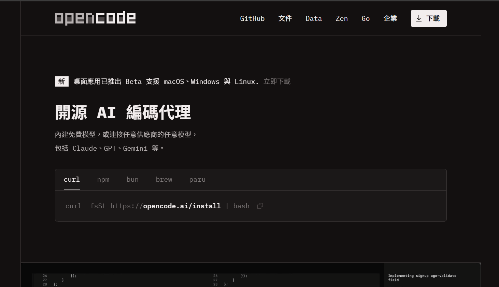
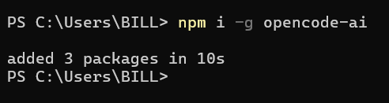
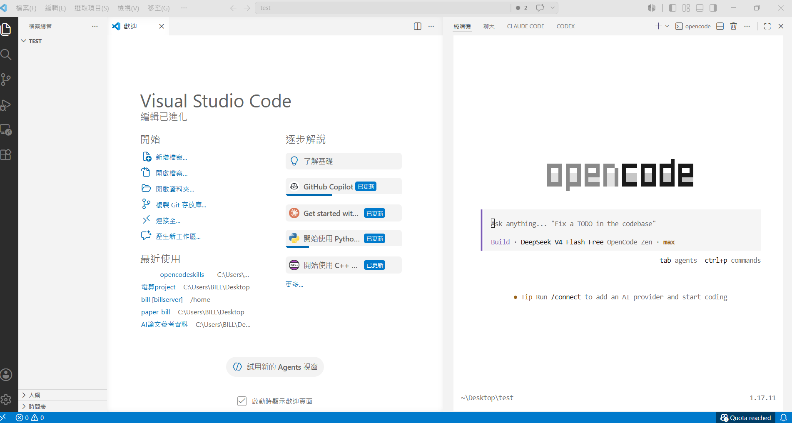
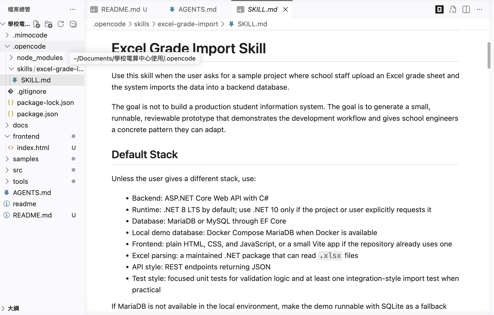
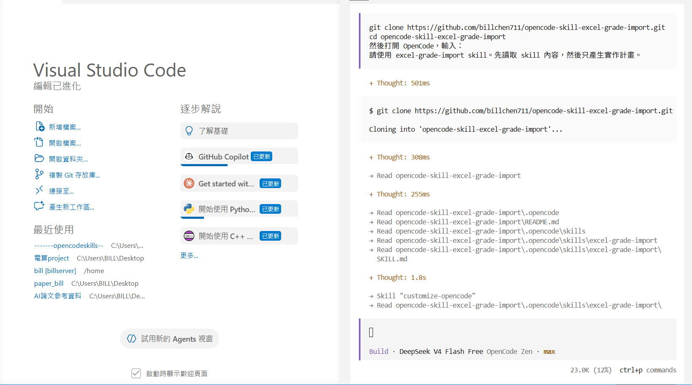
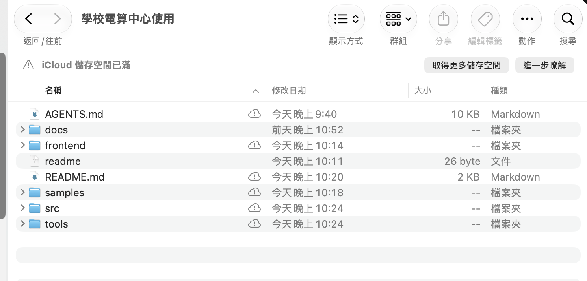
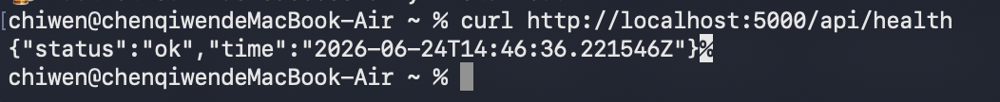

# 使用 OpenCode 與 SKILL.md 建立成績 Excel 匯入 Demo

> **整理者：** ChiWen  
> **日期：** 2026-06-25  
> **版本：** 1.2

---

## 文件目的

這份手冊記錄如何在 Windows 環境中，使用 OpenCode 讀取既有的 `SKILL.md` 規格檔，產生一個可執行的成績 Excel 匯入範例。

這個 demo 的重點不是交付正式校務系統，而是示範工程師如何把需求整理成可重複使用的規格檔，再讓 coding agent 依照規格產生初步的前端、後端、資料庫與測試流程。產生出的程式碼仍需要由工程師審查、調整與維護。

本範例使用 SQLite 作為本機 demo 資料庫。若要接到學校正式資料庫，需要由工程師依照校內既有 API、資料庫類型與資安規範另外串接。

> 注意：這個 GitHub repo 目前主要放的是 `SKILL.md`、`AGENTS.md` 和操作手冊。前端、後端與資料庫專案會在後面的步驟中由 OpenCode / MimoCode 依照規格產生；剛 clone 下來時如果還沒有 `src/GradeImport.Api` 之類的資料夾，這是正常的。

---

## 這份文件的用途

了解如何用 `SKILL.md` 指引 OpenCode / MimoCode 產生 prototype，並判斷後續需要補強的部分。

---

## 環境準備

開始前需要先安裝下列工具：

| 軟體 | 用途 | 參考連結 |
|------|------|----------|
| Git | 從 GitHub 下載專案 | https://git-scm.com/ |
| VS Code | 開啟專案與編輯檔案 | https://code.visualstudio.com/ |
| Node.js + npm | 安裝與執行 OpenCode 需要用到 | https://nodejs.org/ |
| .NET SDK | 執行 C# ASP.NET Core 後端 | https://dotnet.microsoft.com/download |
| OpenCode 或 MimoCode | 讓 coding agent 讀取規格並產生範例專案 | 依各工具官方文件安裝 |

常見安裝指令：

```bash
# macOS
brew install dotnet-sdk

# Linux
sudo apt install dotnet-sdk-10.0
```

```powershell
# Windows
winget install Microsoft.DotNet.SDK.10
npm i -g opencode-ai

# 如果 PowerShell 阻擋 OpenCode 執行，可以調整目前使用者的執行政策
Set-ExecutionPolicy -ExecutionPolicy RemoteSigned -Scope CurrentUser
```

安裝完成後，先確認這些指令都有版本資訊或正常回應：

```powershell
git --version
node --version
npm --version
dotnet --version
opencode --version
```

如果使用的是 MimoCode，請依照 MimoCode 的安裝方式確認工具可以在 VS Code 中正常開啟。詳細安裝步驟可參考 `docs/environment-setup.zh-TW.md`。

---

## 取得範例專案

環境準備完成後，先從 GitHub 下載這份 demo 專案：

```bash
git clone https://github.com/billchen711/opencode-skill-excel-grade-import.git
cd opencode-skill-excel-grade-import
code .
```

開啟 VS Code 後，再啟動 OpenCode 或 MimoCode。若是使用 OpenCode，可以從 VS Code 側邊欄開啟 OpenCode 面板；若沒有使用擴充套件，也可以在 VS Code 終端機中執行 `opencode`。

後續操作會讓 coding agent 讀取專案內的 `AGENTS.md` 和 `.opencode/skills/excel-grade-import/SKILL.md`。開始前請先確認 OpenCode / MimoCode 已經可以正常對話，且模型額度或登入狀態可用。

---

## Windows 環境截圖紀錄

以下是這次在 Windows 上實際操作時保留下來的畫面，可放在報告中作為操作證明。


**圖 1：** 在 Windows 桌面建立 `test` 工作資料夾，作為這次 demo 專案的位置。



**圖 2：** OpenCode 官方安裝頁面，依照作業系統選擇對應的安裝方式。



**圖 3：** 在 PowerShell 中使用 `npm i -g opencode-ai` 安裝 OpenCode，畫面顯示安裝完成。



**圖 4：** 在 VS Code 中開啟專案資料夾，右側開啟 OpenCode 面板，準備讓它讀取規格檔。

---

## 操作流程

### Step 1：確認 SKILL.md 規格檔

這次的主要輸入檔是：

```text
.opencode/skills/excel-grade-import/SKILL.md
```

這份檔案會告訴 OpenCode 這個 demo 要做到哪些事，例如：

- 使用 C# ASP.NET Core Web API 建立後端。
- 使用簡單 HTML、CSS、JavaScript 建立前端上傳頁面。
- 允許一般教職員上傳成績 Excel 檔。
- 依照 `SKILL.md` 中定義的學校成績單格式解析資料：前幾列是學期、班級、教師、課程等資訊，學生資料從後面的資料列開始。
- 檢查學號、中文姓名、學期成績與各項分數欄位。
- 把通過檢查的資料寫入本機 SQLite 資料庫。
- 回傳匯入成功筆數、失敗筆數，以及每一列的錯誤原因。



### Step 2：要求 OpenCode 先提出實作計畫

在讓 OpenCode 寫程式前，先要求它讀取 `SKILL.md`，並且只產生計畫。這樣做的目的，是先確認它理解的方向是否正確，避免一開始就產生大量不符合需求的程式碼。

可使用的 prompt：

```text
請先閱讀 AGENTS.md 和 .opencode/skills/excel-grade-import/SKILL.md。

請使用 excel-grade-import skill，先只產生實作計畫，不要修改或建立任何檔案。

計畫請包含：專案結構、後端 API、資料庫 schema、Excel 欄位與驗證規則、前端畫面、執行指令、測試方式，以及 demo 步驟。
```

看到計畫後，先檢查是否至少有包含以下內容：

- 後端 API 要怎麼收 Excel 檔。
- Excel 會怎麼解析與驗證。
- SQLite 資料表大致怎麼設計。
- 前端會有哪些畫面。
- 後端與前端要怎麼啟動。
- 會如何測試正確檔案與錯誤檔案。

如果計畫缺少這些項目，先請 OpenCode 補計畫，不要直接進入實作。



**圖 5：** OpenCode 開始讀取 GitHub 專案與 `.opencode/skills/excel-grade-import/SKILL.md`。這張圖可以證明 coding agent 的輸入來源不是口頭描述，而是已經整理好的規格檔。

> 展示時可補充：OpenCode 產生實作計畫的畫面，建議檔名為 `screenshots/windows-opencode-skill-tutorial/03-agent-plan/02-agent-plan-output.png`。

### Step 3：依照計畫產生範例專案

確認實作計畫沒有偏離需求後，再請 OpenCode 開始建立範例專案。這個階段預期會產生：

- 後端 API 專案。
- 前端上傳頁面。
- SQLite 資料庫設定。
- Excel 解析與資料驗證邏輯。
- 假資料或範例 Excel。
- README 或執行指令。

可使用的確認 prompt：

```text
我確認這個實作計畫，請依照計畫建立 demo 專案。
```



> 展示時可補充：OpenCode 產生檔案或完成專案結構的畫面。

### Step 4：啟動後端 API

範例專案產生後，先啟動後端。以下路徑是本 demo 預期的專案結構；如果 OpenCode 產生的資料夾名稱不同，請以它最後提供的 README 或執行指令為準。

```bash
cd src/GradeImport.Api
dotnet run --urls "http://localhost:5000"
```

看到後端持續執行後，不要關閉該終端機。接著可以用瀏覽器或 API 工具測試：

```text
http://localhost:5000/api/health
```



### Step 5：開啟前端上傳頁面

用瀏覽器開啟前端頁面，例如：

```text
src/grade-import-frontend/index.html
```

畫面應該會看到「成績 Excel 匯入」、檔案選擇按鈕、上傳按鈕，以及匯入結果區塊。

> 展示時可補充：前端上傳頁面。

### Step 6：上傳正確 Excel

使用範例正確檔案進行測試，例如：

```text
sample-data/valid-grades.xlsx
```

這個檔案應該由 OpenCode 在 Step 3 產生。如果沒有看到 `sample-data` 或範例 Excel，可以回到 OpenCode 輸入：

```text
請補上可用於 demo 的假資料 Excel 檔案，包含一份正確資料和一份錯誤資料，並說明檔案路徑。
```

預期結果：

- 系統顯示總筆數。
- 成功筆數大於 0。
- 失敗筆數為 0。
- 匯入後可在畫面或 API 中看到成績資料。

> 展示時可補充：正確 Excel 匯入成功結果。

### Step 7：上傳錯誤 Excel

再使用包含錯誤資料的 Excel 測試，例如分數超過 100、缺少學號、或同一位學生同一門課重複匯入。

預期結果：

- 系統不會只顯示程式錯誤。
- 畫面會列出第幾列、哪個欄位、錯誤原因。
- 錯誤訊息要讓一般教職員看得懂。

> 展示時可補充：錯誤明細表格。

### Step 8：查看本機資料庫結果

若要確認資料確實寫入 SQLite，可以用畫面上的「已匯入成績」或 `GET /api/grades` 檢查。若電腦有安裝 `sqlite3` 指令，也可以用下列方式查看：

```bash
sqlite3 src/GradeImport.Api/grades.db "SELECT * FROM Grades;"
```

這一步只是 demo 驗證方式，不是必要步驟。正式系統通常不會讓一般使用者直接查資料庫，而是透過後端 API 或管理介面查看資料。

> 展示時可補充：資料庫查詢結果。

---

## 如果操作中卡住

| 狀況 | 處理方式 |
|------|----------|
| `git` 找不到 | 安裝 Git，重新開啟 PowerShell 或 VS Code 終端機後再試一次。 |
| `node` 或 `npm` 找不到 | 安裝 Node.js LTS，重新開啟終端機後執行 `node --version` 和 `npm --version`。 |
| `opencode` 找不到 | 先執行 `npm i -g opencode-ai`，再重新開啟終端機確認 `opencode --version`。 |
| `dotnet` 找不到 | 安裝 .NET SDK，重新開啟終端機後執行 `dotnet --version`。 |
| 後端啟動失敗或 port 被占用 | 可改用其他 port，例如 `dotnet run --urls "http://localhost:5001"`，並同步調整前端呼叫的 API 位址。 |
| OpenCode 直接開始改檔案 | 停止目前動作，重新要求它「只產生實作計畫，不要修改或建立檔案」。 |

---

## 展示時建議補充的截圖

後續如果要整理成完整 HackMD 報告，建議至少補上以下畫面：

| 順序 | 建議檔名 | 目的 |
|------|----------|------|
| 1 | `03-agent-plan/02-agent-plan-output.png` | 證明 OpenCode 有先產生實作計畫。 |
| 2 | `04-agent-build/01-agent-generating-files.png` | 顯示 OpenCode 依照計畫產生專案檔案。 |
| 3 | `04-agent-build/02-generated-project-tree.png` | 顯示產生後的前端、後端、資料夾結構。 |
| 4 | `05-run-backend/01-dotnet-run-success.png` | 顯示後端 API 成功啟動。 |
| 5 | `06-frontend-upload/01-upload-page.png` | 顯示一般教職員會使用的上傳頁面。 |
| 6 | `07-results/01-success-import.png` | 顯示正確 Excel 匯入成功。 |
| 7 | `07-results/02-error-import.png` | 顯示錯誤 Excel 的逐列錯誤訊息。 |
| 8 | `07-results/03-imported-grades-preview.png` | 顯示匯入後資料可被查詢或預覽。 |

---

## Demo 範圍說明

這份 demo 只用假資料，不使用真實學生資料。

目前版本的資料庫是本機 SQLite，目的是讓展示流程可以在單機上跑起來。正式環境若要接學校資料庫，仍需要工程師補上登入權限、資料庫連線、稽核紀錄、備份機制、檔案掃描與部署設定。

因此，這份手冊要展示的是「如何用規格檔引導 coding agent 產生可檢查的 prototype」，不是宣稱 coding agent 可以直接取代正式系統開發。
